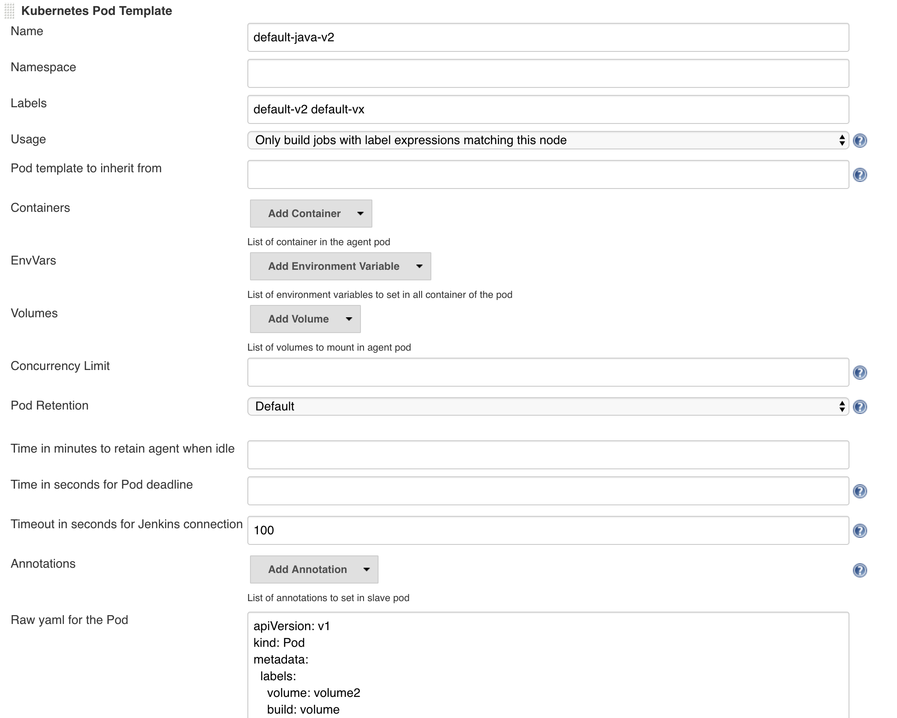

= Use Case: Limited Host Volume Usage

The use case is as follows, builds require a vast amount of data which is managed on the Kubernetes Worker Nodes.

Due to how the folder on the Host is used, we can only limit one build access to this volume at a time.

== Requirements

We have the following requirements:

* use data on host
* maximum one build per folder
* ability to execute more than one job a time
* should not impair scheduling of the jobs

== Solution

* have multiple copies of the data on the host 
** synchronize each copy when used (to limit staleness)
* configure Kubernetes Labels on the Nodes to provide the ability to know if required data is present
* use NodeAffinity configuration in PodTemplate to only select nodes that have the data
* label the Pods so we know if a specific pod is running on a node
* use the labels of the Pod to set a PodAntiAffinity to limit this Pod to One-Per-Node
* create multiple PodTemplates in CloudBees Core each looking at a unique copy of the data
* use agent/node label to select all possible PodTemplates so jobs will be spread over all Nodes/Data Copies

== PodTemplate Configuration

For the PodTemplate we have to configure the following fields:

* **name**: e.g. `default-java-v2`
* **label**: e.g. `java-v2 java-vx`
* **Raw yaml**: see configuration below

=== Raw Yaml

==== Pod Labels

We have to add labels to the Pod, else we cannot use PodAntiAffinity.

[source,yaml]
----
metadata:
  labels:
    volume: volume1
    build: volume
----

==== NodeAffinity

Node Affinity allows us to select nodes with certain labels.

The below snippet will only run on nodes with the label `com.cloudbees.demo=true`.

[source,yaml]
----
spec:
  affinity:
    nodeAffinity:
      requiredDuringSchedulingIgnoredDuringExecution:
        nodeSelectorTerms:
        - matchExpressions:
          - key: com.cloudbees.demo
            operator: In
            values:
            - true
----

See link:https://kubernetes.io/docs/concepts/configuration/assign-pod-node/#node-affinity[Kubernetes Documentation] for more information

To add a label to the node, use the following:

[source,bash]
----
kubectl label nodes <nodeName> com.cloudbees.demo=true
----

==== PodAntiAffinity

The PodTemplates have a volume of type `HostPath` that can only be used once.
So we need to make sure each will only schedule a Pod one at a time.

We can achieve this with `podAntiAffinity`, which selects a Pod via label selectors and "groups" it by `topologyKey`.

The `topologyKey` must be a default node label, in this case we use hostname as it will give us Pod per Host.

[source,yaml]
----
spec:
  affinity:
    podAntiAffinity:
      requiredDuringSchedulingIgnoredDuringExecution:
      - labelSelector:
          matchExpressions:
          - key: volume
            operator: In
            values:
            - volume1
        topologyKey: "kubernetes.io/hostname"
----

See link:https://kubernetes.io/docs/concepts/configuration/assign-pod-node/#an-example-of-a-pod-that-uses-pod-affinity[Kubernetes Documentation] for more information

==== Yaml

.PodTemplateRawYaml
[source,yaml]
----
apiVersion: v1
kind: Pod
metadata:
  labels:
    volume: volume1
    build: volume
spec:
  affinity:
    nodeAffinity:
      requiredDuringSchedulingIgnoredDuringExecution:
        nodeSelectorTerms:
        - matchExpressions:
          - key: com.cloudbees.demo
            operator: In
            values:
            - true
    podAntiAffinity:
      requiredDuringSchedulingIgnoredDuringExecution:
      - labelSelector:
          matchExpressions:
          - key: volume
            operator: In
            values:
            - volume1
        topologyKey: "kubernetes.io/hostname"
  securityContext:
    runAsUser: 1000
    fsGroup: 1000
  containers:
  - name: jnlp
    volumeMounts:
    - mountPath: /home/gradle
      name: my-volume-1
  volumes:
  - hostPath:
      path: /tmp/test
    name: my-volume-1
----

== Pipeline Configuration

== Watch Pods

[source,bash]
----
kubectl get po -o wide -l build=volume
----

== Jenkinsfile

.Jenkinsfile
[source,groovy]
----
pipeline {
    agent { label 'default-v2||default-v1||default-vx' }
    stages {
        stage('Test') {
            steps {
                println 'hello world'
            }
        }
        stage('Sleep') {
            steps {
                sleep 60
            }
        }
    }
}
----